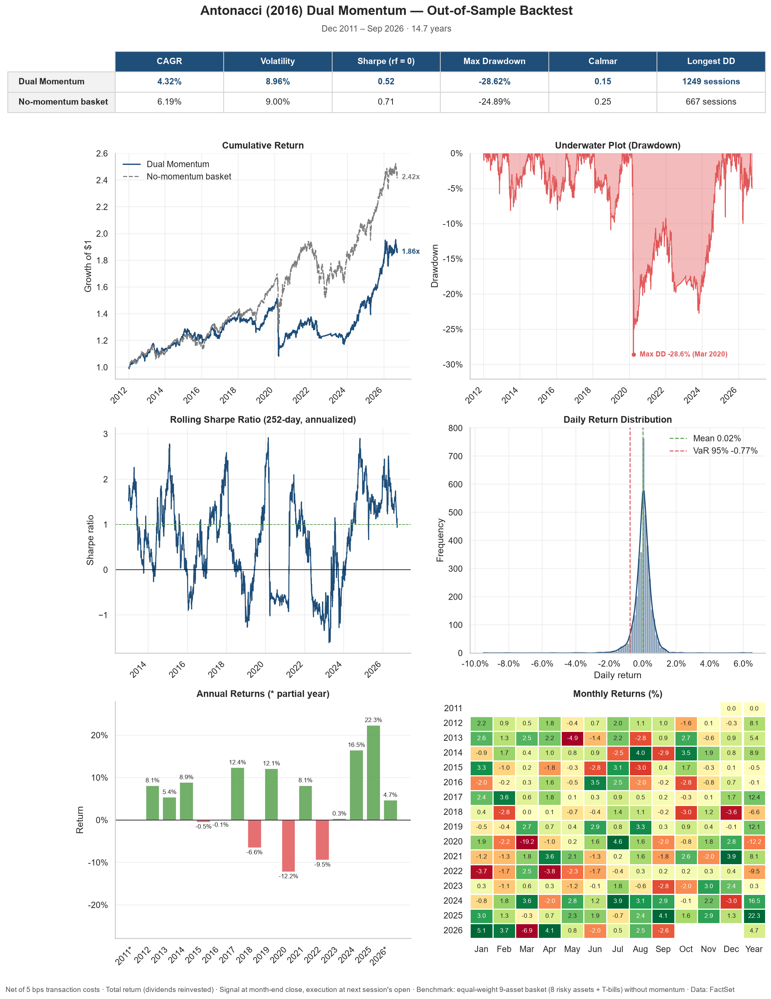

# Dual Momentum, Out of Sample

An out-of-sample test of Gary Antonacci's *Risk Premia Harvesting Through Dual Momentum* (2012, rev. 2016), replicated with ETFs from December 2011 to September 2026.

The paper's results cover 1974–2011 and its data stop in December 2011, so every month since then is a genuine out-of-sample test of the same rules.

**Bottom line:** the paper's thesis does not replicate out of sample. Dual momentum returned 4.32% a year against 6.19% for the paper's own no-momentum benchmark, with a deeper maximum drawdown (−28.62% vs. −24.89%).

Full write-up: [Dual_Momentum_OOS_Backtest.pdf](Dual_Momentum/results/Dual_Momentum_OOS_Backtest.pdf)



## The strategy

The portfolio is split equally across four modules, each targeting a different risk premium. At every month-end, inside each module:

1. **Relative momentum** picks the asset with the higher 12-month total return.
2. **Absolute momentum** holds that asset only if its 12-month return beats T-bills; otherwise the module moves to T-bills.

The paper finds that both filters add return, but only absolute momentum substantially reduces volatility and drawdown. Over 1974–2011 the four-module composite earned 14.90% a year with a −10.92% maximum drawdown, against 9.93% and −27.00% for the nine assets (T-bills included) held in equal weight without momentum. Those results are in-sample and before costs.

## Results

| Metric | Paper (1974–2011, in-sample) | This backtest (Dec 2011 – Sep 2026) |
|---|---|---|
| Annual return (CAGR) | 14.90% | 4.32% |
| Volatility | 7.99% | 8.96% |
| Sharpe ratio (rf = T-bills) | 1.07 | 0.38 |
| Sharpe ratio (rf = 0) | — | 0.52 |
| Maximum drawdown | −10.92%\* | −28.62% |
| Positive months | 73% | 63.6% |
| Return vs. no-momentum basket | +4.97 pp | −1.87 pp |
| Transaction costs | None deducted | 5 bps on turnover |

**Effect decomposition** (replication of the paper's Table 14)

| Variant | CAGR | Vol. | Sharpe (rf = 0) | Sharpe (rf = T-bills) | Max DD | Paper CAGR | Paper Sharpe | Paper Max DD\* |
|---|---|---|---|---|---|---|---|---|
| No momentum | 6.19% | 9.00% | 0.71 | 0.56 | −24.89% | 9.93% | 0.50 | −27.00% |
| Absolute only | 3.29% | 6.21% | 0.55 | 0.33 | −22.27% | 11.76% | 1.05 | −7.52% |
| Relative only | 7.63% | 10.53% | 0.75 | 0.64 | −28.62% | 14.21% | 0.80 | −27.29% |
| **Dual momentum** | **4.32%** | **8.96%** | **0.52** | **0.38** | **−28.62%** | **14.90%** | **1.07** | **−10.92%** |

\* The paper measures drawdown on month-end data. Here it is the deepest point of the daily equity curve, so the paper's figures are a lower bound of what daily data would show.

What went wrong out of sample:

- **The edge reversed**, in both halves of the period, not in a single episode.
- **Absolute momentum did not cut the drawdown.** A monthly signal is too slow to exit a fast crash such as COVID-19 and too slow to re-enter afterwards.
- **The safe asset stopped paying.** T-bills returned 0.41% a year until mid-2019, against 5.89% on average in the paper's sample, so every exit parked capital at near-zero rates.

## Implementation

| Module | Paper indices (asset A / asset B) | ETFs used |
|---|---|---|
| Equities | MSCI US / EAFE+ (MSCI ACWI ex US) | SPY / ACWX |
| Credit | BofA US Cash Pay High Yield / US Intermediate Credit | HYG / IGIB |
| REITs | FTSE Nareit Equity REITs / Mortgage REITs | USRT / REM |
| Economic Stress | US Long Treasury / Gold | VGLT / GLD |
| Safe asset | 3-month US T-bills | BIL, then SGOV from July 2020 |

- **Same rules as the paper:** 12-month lookback with no skip month, 25% per module, monthly rebalancing.
- **Execution:** the signal uses the last close of each month and trades at the next session's open. The paper does not specify execution, and with no skip month, trading on the signal's own close would introduce look-ahead bias. The first trade is on 3 January 2012.
- **Prices:** total return (dividends reinvested, gross of withholding tax), from FactSet.
- **Costs:** 5 bps on turnover; `metrics.json` also reports 0, 10 and 20 bps.
- **Benchmark:** the paper's Table 14 no-momentum portfolio, the eight risky assets plus T-bills at 1/9 each.
- **Engine:** a vectorized daily backtester (`src/engine.py`). Target weights are held constant between monthly signals, which implies daily rebalancing to target; the benchmark is treated the same way.
- **Sharpe ratios:** rf = 0 uses daily net returns annualized with √252; rf = T-bills uses monthly returns in excess of T-bills annualized with √12.

## Repository layout

```text
src/              vectorized backtest engine, performance metrics, tearsheet plots
tests/            pytest suite for the engine, metrics and plots
scripts/          converter from FactSet price exports to the long-format parquet
Dual_Momentum/
  run.py          signal, Table 14 variants, diagnostics and outputs
  results/        metrics.json, tearsheet.png and the PDF write-up
```

## Reproducing

Requires Python 3.12.

```bash
pip install -r requirements.txt
pytest
```

The price data are not included because the FactSet license does not allow redistribution. `run.py` expects `Dual_Momentum/oos_data.parquet` in long format with columns `date, ticker, open, close`, dividend-adjusted, starting no later than December 2010, for the tickers `SPY-US, ACWX-US, HYG-US, IGIB-US, USRT-US, REM-US, VGLT-US, GLD-US, BIL-US, SGOV-US`.

From FactSet *Price History* exports that include the *Total Return (Gross)* column:

```bash
python scripts/convert_factset.py --total-return <export files or folder> Dual_Momentum/oos_data.parquet
python Dual_Momentum/run.py
```

Any other source works if it produces the same long format; results will differ slightly from the FactSet run.

## Reference and disclaimer

Antonacci, G. (2016). *Risk Premia Harvesting Through Dual Momentum*. SSRN: <https://ssrn.com/abstract=2042750>

For research and educational purposes only. Past performance, simulated or real, does not guarantee future results. This is not investment advice.

## License

The code is released under the [MIT License](LICENSE). Price data are not included.
